# 💡 스프링 컨테이너와 스프링 빈 
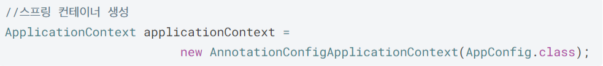
- `ApplicationContext`는 스프링 컨테이너고 인터페이스이다.
- `new AnnotationConfigApplicationContext(AppConfig.class);`는 `ApplicationContext` 인터페이스 구현체이다.
- `AppConfig`는 스프링 컨테이너의 구성 정보를 설정하는 설정 파일이다.

## 스프링 컨테이너 생성 과정
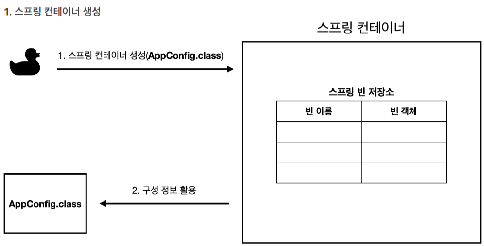

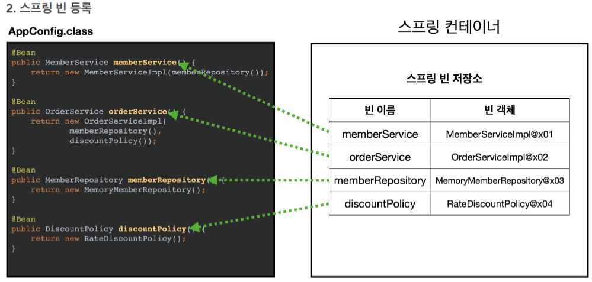
- 구성 정보(`AppConfig`)를 참고하여 스프링 컨테이너 내에 있는 스프링 빈 저장소에 빈을 등록한다.
- `@Bean`이 붙은 메소드명이 빈 이름, 리턴하는 객체의 참조값이 빈 객체로 등록된다.

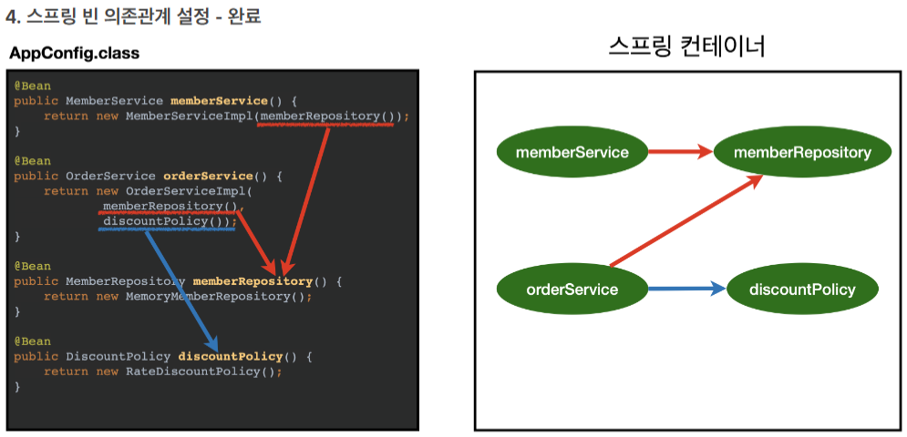
- 스프링 컨테이너는 설정 정보(`AppConfig.class`)를 참고해서 의존관계를 주입(DI)을 한다.

## 스프링 빈 조회 
- 스프링 빈은 **스프링 내부에서 사용하는 빈**과 **개발자가 정의한 애플리케이션 빈** 두 가지가 존재한다.
	- `ROLE_APPLICATION`: 개발자가 정의한 빈
	- `ROLE_INFRASTRUCTURE`: 스프링 내부에서 사용하는 빈 
- 스프링 빈 조회 메서드
	- `getBeanDefinitionNames()`: 스프링에 등록된 모든 빈 이름 조회
	- `getBean(이름, 타입)`: 빈 이름으로 빈 객체(인스턴스) 조회
		- `getBean(타입)`: 타입만으로 조회할 수 있다.
	- `getRole()`: 스프링 내부 사용 빈 or 개발자 정의 빈 조회
	- `getBeansOfType(타입)`: 해당 타입의 모든 빈 조회 
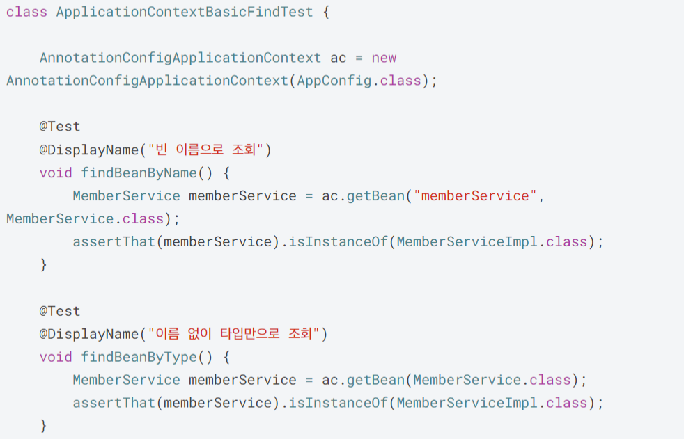
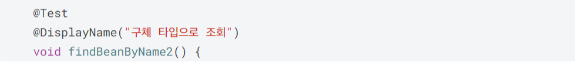
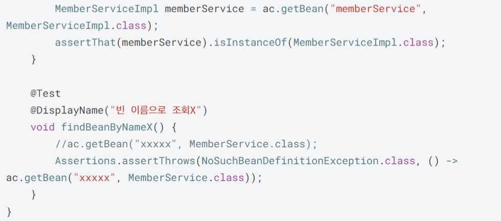

### 동일한 타입이 둘 이상 있는 경우
- 타입으로 조회시 같은 타입의 스프링 빈이 둘 이상이면 오류가 발생한다.
- 이 경우 빈 이름을 지정해서 오류를 피할 수 있다.
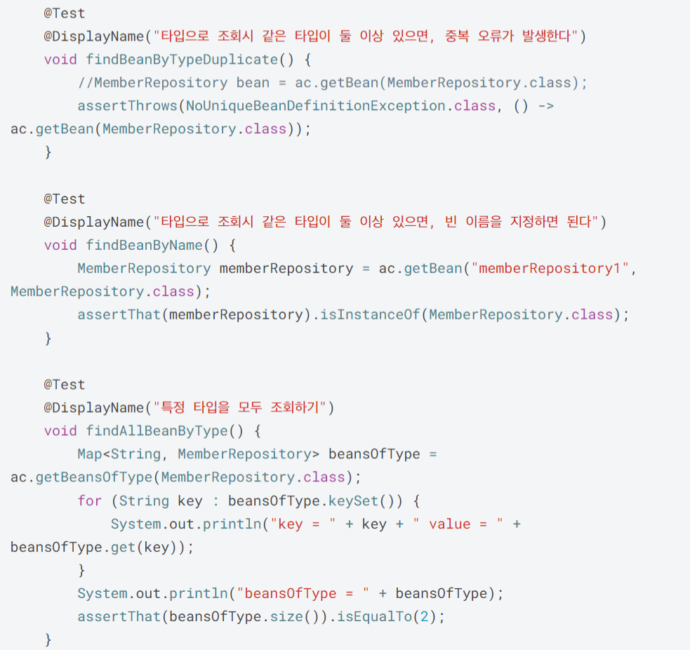

### 상속 관계 조회
- 부모 타입으로 조회하면, 자식 타입도 함께 조회한다.
- 모든 자바 객체의 최고 부모인 `Object` 타입으로 조회하면, 모든 스프링 빈을 조회한다.

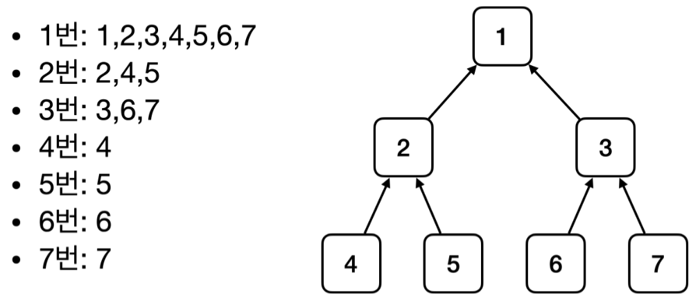

- `RateDiscountPolicy`와 `FixDiscountPolity` 두 자식이 있으므로 중복 오류가 발생한다.

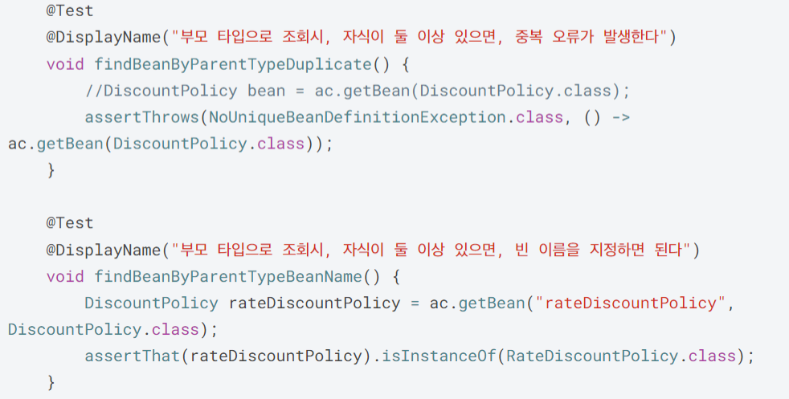
- 자식이 둘 이상 있으면 자식 타입으로 조회하거나 빈 이름을 지정하는 방법이 있다.

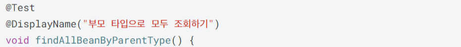
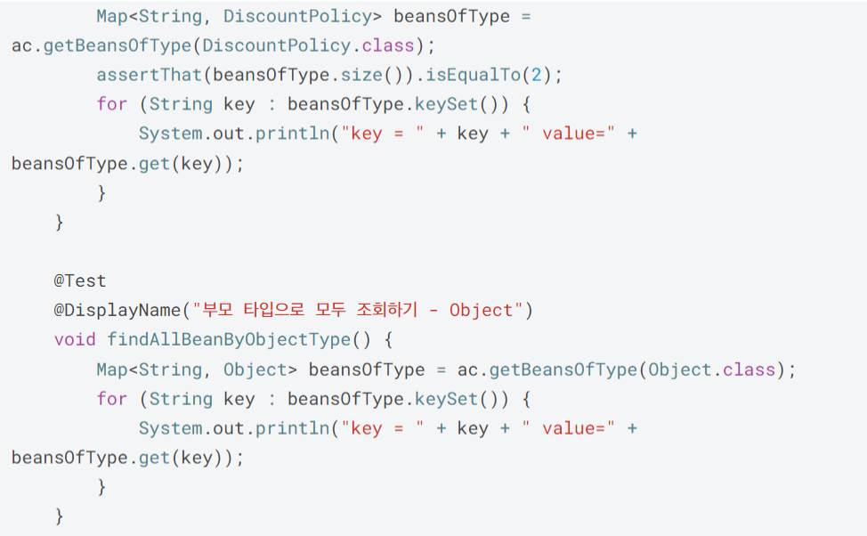
- `DiscountPolicy` 타입과 자식 타입 빈 모두 조회
- `Object` 타입을 이용하여 스프링 컨테이너에 등록된 모든 빈 조회
## BeanFactory와 ApplicationContext
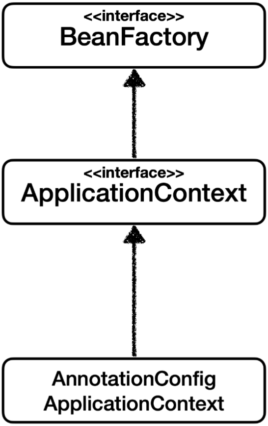
### BeanFactory(스프링 컨테이너)
- 스프링 컨테이너의 최상위 인터페이스
- `getBean()` 메서드 제공
### ApplicationContext(스프링 컨테이너)
- BeanFactory 기능을 상속 받아 제공하는 인터페이스
- BeanFactory에 더해서 부가 기능들을 제공함
### AnnotationConfigApplicationContext
- ApplicationContext 인터페이스 구현체
- 컨테이너 접근 시 사용함
거의 대부분의 경우 부가 기능이 포함된 **ApplicationContext**를 사용함

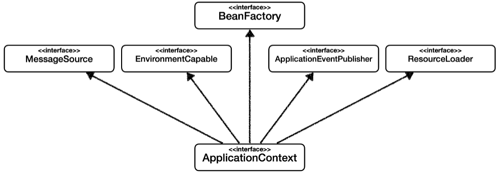

- `ApplicationContext`는 `BeanFactory`에서 제공하는 기능 뿐만 아니라 부가적인 기능들도 제공하는 인터페이스이다.
- 부가 기능
	- **메시지소스를 활용한 국제화 기능**
		- 예를 들어서 한국에서 들어오면 한국어로, 영어권에서 들어오면 영어로 출력
	- **환경변수**
		- 로컬, 개발, 운영등을 구분해서 처리
	- **애플리케이션 이벤트**
		- 이벤트를 발행하고 구독하는 모델을 편리하게 지원
	- **편리한 리소스 조회**
		- 파일, 클래스패스, 외부 등에서 리소스를 편리하게 조회

## 스프링 컨테이너 설정 형식 - 어노테이션, JAVA 코드, XML
- 지금까지 설명한 방식은 어노테이션 방식이고 JAVA 코드 방식과 XML 방식을 이용하여 스프링 컨테이너 설정을 할 수 있다.
- 하지만 대부분의 경우 어노테이션을 사용하기 때문에 이 부분은 넘어간다. 

## 스프링 빈 설정 메타 정보 - BeanDefinition
다양한 스프링 컨테이너 설정 형식을 지원할 수 있는 이유는 `BeanDefinition`이라는 추상화 덕분이다.

- 세 가지 구체적인 설정 형식을 추상화한 것이 `BeanDefinition`이고 스프링 컨테이너는 `BeanDefinition`만 참조하여 스프링 빈을 관리할 수 있다.

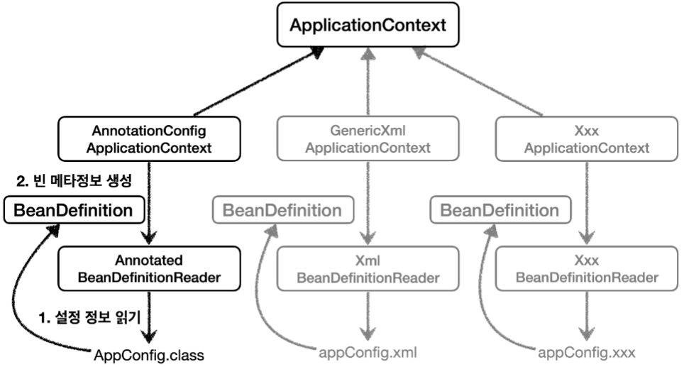
- `AnnotationConfigApplicationContext`는 `AnnotatedBeanDefinitionReader`를 사용해서 `AppConfig.class` 를 읽고 `BeanDefinition` 을 생성한다.
- `GenericXmlApplicationContext` 는 `XmlBeanDefinitionReader` 를 사용해서 `appConfig.xml` 설정 정보를 읽고 `BeanDefinition` 을 생성한다.
- 새로운 형식의 설정 정보가 추가되면, `XxxBeanDefinitionReader`를 만들어서 `BeanDefinition` 을 생성하면 된다

### BeanDefinition 정보(참고)
- **BeanClassName**: 생성할 빈의 클래스 명(자바 설정 처럼 팩토리 역할의 빈을 사용하면 없음)
- **factoryBeanName**: 팩토리 역할의 빈을 사용할 경우 이름, 예) appConfig
- **factoryMethodName**: 빈을 생성할 팩토리 메서드 지정, 예) memberService
- **Scope**: 싱글톤(기본값)
- **lazyInit**: 스프링 컨테이너를 생성할 때 빈을 생성하는 것이 아니라, 실제 빈을 사용할 때 까지 최대한 생성을 지연 처리 하는지 여부
- **InitMethodName**: 빈을 생성하고, 의존관계를 적용한 뒤에 호출되는 초기화 메서드 명
- **DestroyMethodName**: 빈의 생명주기가 끝나서 제거하기 직전에 호출되는 메서드 명
- **Constructor arguments, Properties**: 의존관계 주입에서 사용한다. (자바 설정 처럼 팩토리 역할의 빈을 사용 하면 없음)