# 📌 목차
- 싱글톤 패턴이란?
- 싱글톤 컨테이너
- 싱글톤 객체의 상태(유지(stateful) vs 무상태(stateless))
- @Configuration이 보장하는 무상태(stateless)
- 요약 정리
# 💡 싱글톤 패턴이란?
> 시스템 전체에서 동일한 객체를 공유하고 싶을 때 사용하는 방식으로써 한 클래스의 객체를 하나만 생성하도록 제한하는 방식이다.

## 싱글톤 패턴을 사용하는 이유
- 웹 어플리케이션은 보통 여러 명의 클라이언트가 동시에 요청을 한다. 
- 여러 요청이 동시에 들어올 경우 아래 그림과 같이 요청이 들어 오는 만큼 객체를 생성하고 요청이 끝나면 소멸한다.
- 이 방식은 메모리 낭비가 너무 심해져서 성능에 문제가 생긴다. 
- 이러한 문제를 해결하기 위한 방식이 **싱글톤 패턴**이다. 
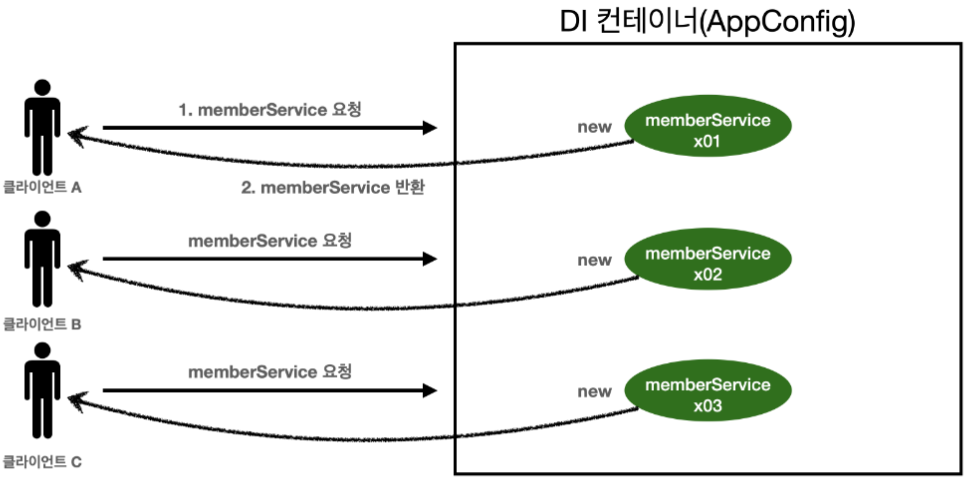

- 싱글톤 패턴을 적용한 어플리케이션은 아래 그림과 같이 여러 요청이 들어와도 하나의 객체만을 사용하게 된다.
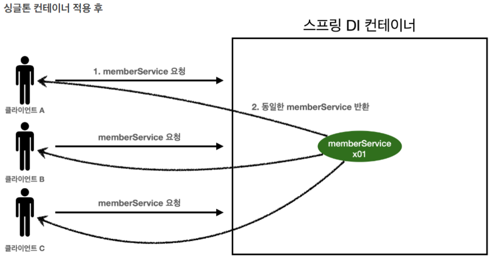
## 싱글톤 패턴의 문제점
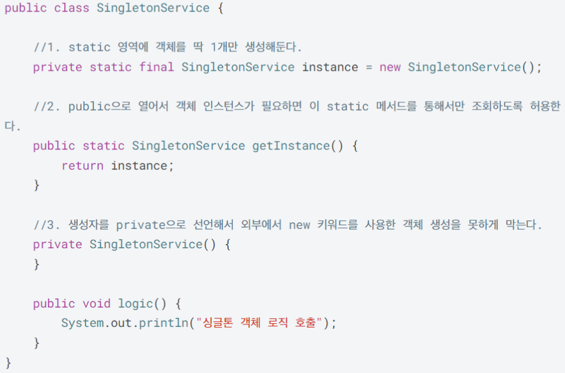

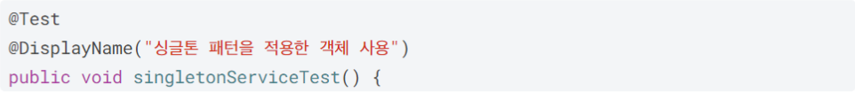
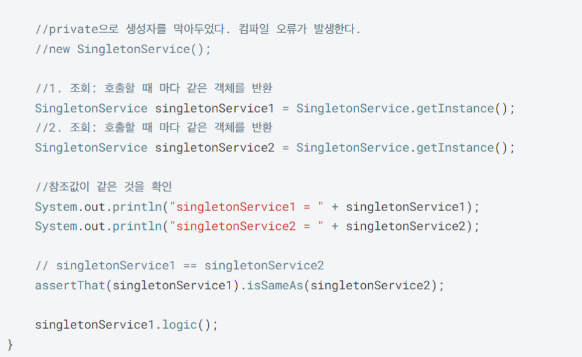
- 싱글톤 구현
	- static 영역에 인스턴스를 미리 하나 생성하여 올려두고 `getInstance()` 요청이 들어오면 static 영역에 있는 인스턴스를 반환하는 방식으로 구현했다.
	- new로 인스턴스를 생성하는 것을 막기 위해 생성자를 private으로 막아두었다.

- 문제점
	- 싱글톤 패턴 구현하는 코드 자체가 많이 필요하다.
	- 클라이언트가 구체 클래스에 의존하여 DIP를 위반한다.
	- 구체 클래스에 의존하기 때문에 OCP를 위반할 가능성이 높다
		- (구체 클래스를 변경할 경우 클래스 내부에서 수정 발생하여 OCP 위반)
	- 테스트하기 어렵다.
	- 내부 속성을 변경하거나 초기화 하기 어렵다.
	- private 생성자로 자식 클래스를 만들기 어렵다.
	- 결론적으로 유연성이 떨어진다.
	- 안티패턴으로 불리기도 한다

이러한 문제를 해결하는 것이 싱글톤 컨테이너(스프링 컨테이너)이다.
# 💡 싱글톤 컨테이너
- **스프링 컨테이너**는 위 싱글톤 패턴의 문제를 모두 해결하면서 인스턴스를 싱글톤으로 관리하기 때문에 **싱글톤 컨테이너 역할**을 한다.
- 즉, 스프링 빈들은 모두 스프링 컨테이너가 싱글톤으로 관리한다. 
- 싱글톤 객체를 생성하고 관리하는 기능을 **싱글톤 레지스트리**라 한다.

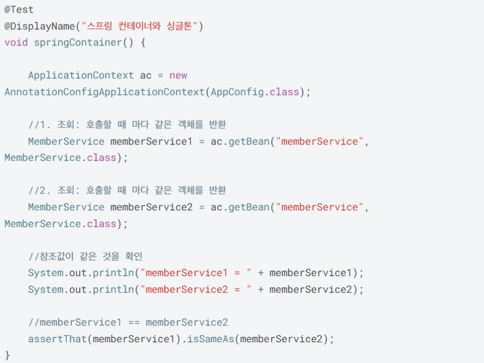
- 위와 같이 스프링 컨테이너를 이용하면 싱글톤 구현 코드 없이 알아서 싱글톤으로 관리해준다.
# 💡 싱글톤 객체의 상태(유지(stateful) vs 무상태(stateless))
- 싱글톤 패턴이나 싱글톤 컨테이너처럼 인스턴스를 하나만 생성해서 공유하는 싱글톤 방식은 여러 클라이언트가 하나의 인스턴스를 공유한다.
- 이로 인해 싱글톤 객체의 상태는 **유지(stateful)가가 아닌 무상태(stateless)로 설계**해야 한다.
## 싱글톤 객체를 유지(stateful) 상태로 설계하면 생기는 문제 
아래 예시는 싱글톤 컨테이너 방식을 사용한 예시이다. 
- `StatefulService`
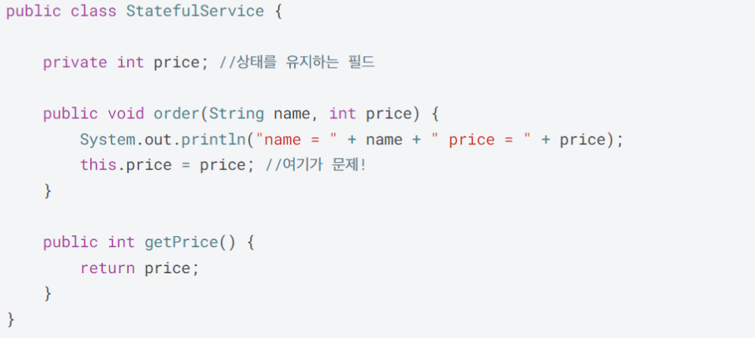

- `StatefulServiceTest`
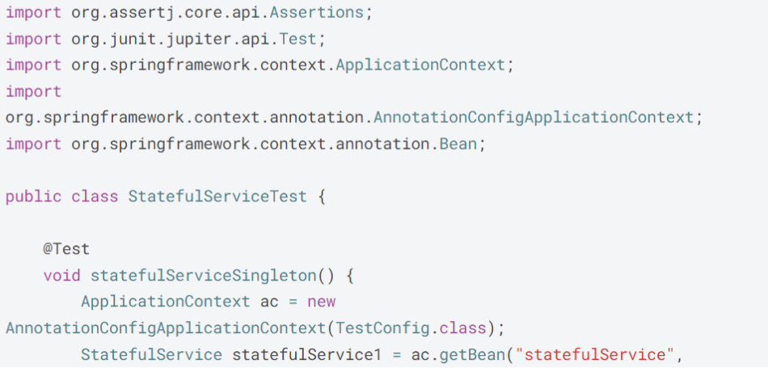
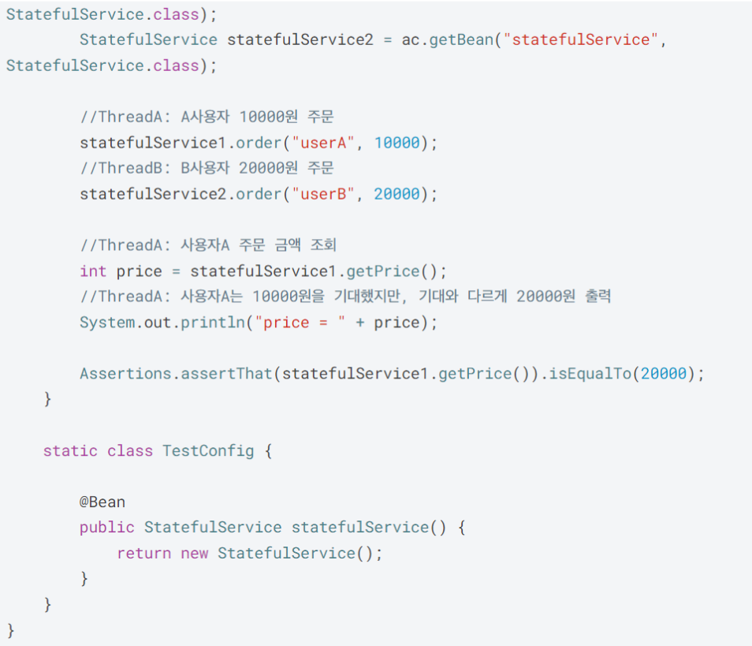

- 두 클라이언트 A와 B가 주문 요청을 보낸 상황이다.
- A 클라이언트가 10000원을 주문하고 바로 B클라이언트가 20000원을 주문한다. 이럴 경우 `StatefulService`의 주문 금액은 10000원에서 20000원으로 바뀌어 저장된다.
- 이후 A 클라이언트의 주문 금액을 확인하면 20000원이 출력된다.
- 이는 `StatefulService` 인스턴스를 두 클라이언트가 공유하기 때문에 늦게 주문한 B 클라이언트가 주문한 금액이 나오는 것이다.

- 이러한 문제를 해결하기 위해 스프링 빈은 항상 **무상태**(**stateless**)로 설계해야 한다.
- 스프링 빈을 무상태로 설계하기 위해선 어떻게 해야 할까?
	- `AppConfig`에 `@Configuration`를 적용하면 무상태를 보장해준다.
# 💡 @Configuration이 보장하는 무상태(stateless)
- 스프링 컨테이너는 싱글톤 레지스트리이기 때문에 스프링 빈이 싱글톤이 되도록 보장해주어야 한다.
- 하지만 스프링이 자바 코드까지 어떻게 하긴 어렵다.
- 이 문제를 해결하기 위해 바이트코드를 조작하는 라이브러리를 사용한다.
- 이때 사용하는 것이 `@Configuration` 어노테이션이다.

- `AppConfig` 클래스에 `@Configuration`를 적용했다. 
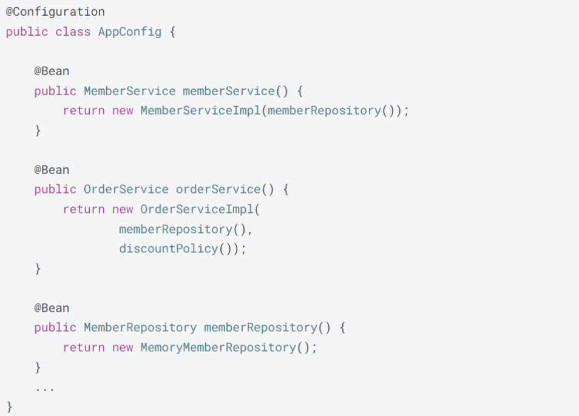

- 아래 그림의 출력 내용을 보면 `AppConfig`도 스프링 빈으로 등록된 것을 볼 수 있다.
- `AnnotationConfigApplicationContext`에 파라미터로 넘긴 값(`AppConfig`)이 스프링 빈으로 등록되기 때문이다.
- 그런데 출력 결과를 보면 `class hello.core.AppConfig` 뒤에 `$$EnhancerBySpringCGLIB$$bd479d70` 값이 붙어 있는 것을 볼 수 있다. 이게 뭘까? 
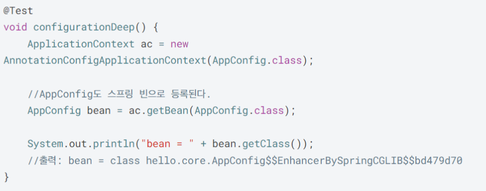

## @Configuration과 바이트코드 조작
- `AppConfig`를 스프링 컨테이너에 스프링 빈으로 등록할 때 CGLIB라는 바이트코드 조작 라이브러리를 사용해서 `AppConfig` 클래스를 상속받은 임의의 다른 클래스를 만들고, 그 다른 클래스를 스프링 빈으로 등록한 것이다.
- 임의의 다른 클래스가 싱글톤 패턴을 보장되도록 해준다.

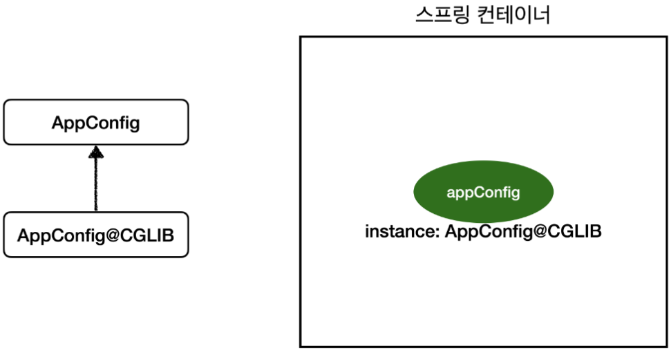

- 그럼 임의의 다른 클래스는 뭐가 달라서 싱글톤 패턴을 보장하는 걸까?
	- CGLIB 내부 기술을 이용하여 바이트 코드를 조작한 `AppConfig` 클래스를 만들어서 싱글톤 패턴을 보장해준다. 정확한 내용은 매우 복잡하기 때문에 구체적으로 알 필요는 없고 아래 설명을 통해 이해해보자. 

- 바이트 코드 조작 전 `AppConfig`
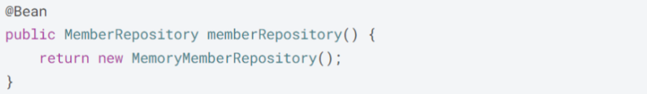

- 바이트 코드 조작 후 `AppConfig`
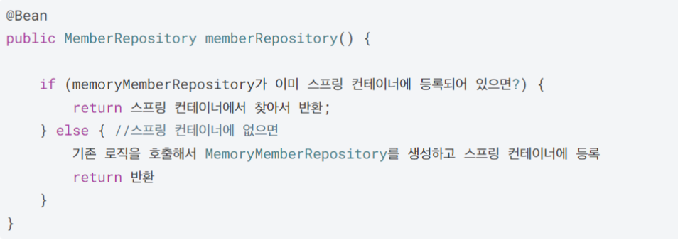

- 위와 같이 `AppConfig`의 `@Bean`이 붙은 메서드마다 스프링 빈이 존재하면 존재하는 빈을 반환하고, 스프링 빈이 없으면 생성해서 스프링 빈으로 등록한 뒤 반환하는 방식으로 코드를 조작하여 싱글톤을 보장하는 것이다. 

# 💡 요약 정리
- 싱글톤 패턴이 적용되지 않은 경우 요청이 들어올 때마다 인스턴스를 생성하고 요청이 끝나면 인스턴스가 소멸되어 메모리를 많이 사용하는 문제가 있다.
- 이러한 문제를 해결하기 위해 싱글톤 패턴을 적용하는데 싱글톤 패턴을 DIP 위반, OCP 위반 등의 문제가 있다.
- 스프링 컨테이너는 싱글톤 레지스트리 기능을 하기 때문에 싱글톤 컨테이너 역할을 하고 싱글톤 패턴에서 발생하는 문제들을 모두 해결하면서 싱글톤을 유지할 수 있다.
- 하지만 스프링 컨테이너도 스프링 빈을 유지(stateful) 상태로 설계하면 동시 접속 시 문제가 발생하여 무상태(stateless)로 설계해야 한다.
- `@Configuration`을 이용하여 무상태(stateless)로 설계하고 발생하는 문제를 해결할 수 있다.

즉, 동시 접속 문제 해결 위해 싱글톤 패턴 적용 필요 -> 싱글톤 패턴 적용 시 발생하는 문제점은 스프링 컨테이너가 해결 -> 스프링 컨테이너가 상태(stateful)로 설계될 경우 발생하는 문제는 `@Configuration`을 이용하여 무상태(stateless)로 설계하여 해결