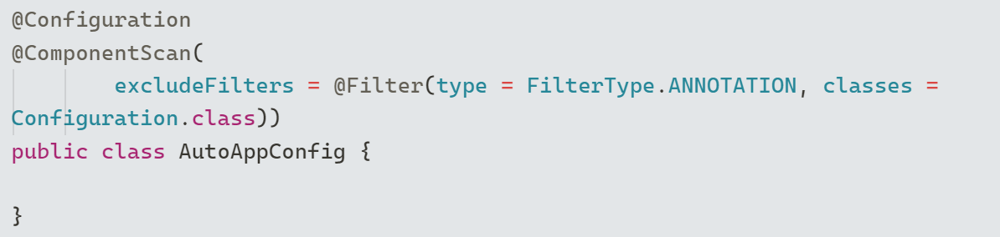
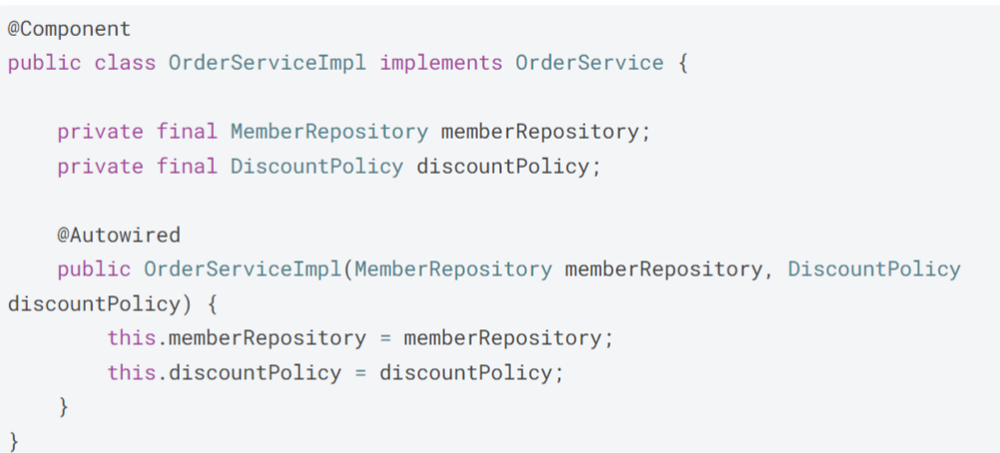
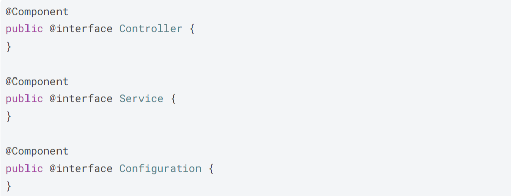

# 📌 목차
- 컴포넌트 스캔과 의존 관계 자동 주입
- 요약 정리
# 💡 컴포넌트 스캔과 의존 관계 자동 주입
[이전 글 - 싱글톤 패턴과 싱글톤 컨테이너](https://tojaman.tistory.com/162)
이전 글에서는 AppConfig 클래스에 `@Bean`을 작성해서 스프링 빈으로 등록했다.
등록해야 할 빈이 몇 개 안된다면 상관없지만 빈을 수십, 수백개를 등록해야 한다면 설정 정보가 너무 커지고 누락 가능성이 있어서 비효율적이다.
따라서 설정 정보가 없어도 자동으로 스프링 빈을 등록하는 `@ComponentScan`이란 기능이 있고 의존관계 주입도 `@Autowired`라는 기능이 있다.

### @ComponentScan, @Component, @Autowired
`@ComponentScan`을 설정 정보(`AppConfig.java`)에 붙이면 `@Component`가 붙은 클래스를 스캔해서 자동으로 스프링 빈으로 등록한다.

- `@ComponentScan`

- `@Component`, `@Autowired`
	- 스프링 빈의 기본 이름을 클래스 명을 사용하되 맨 앞글자는 소문자로 사용된다.
	- 만약 스프링 빈의 이름을 지정하고 싶다면 `@Compoent("이름")` 형식으로 설정하면 된다.

이렇게 작성하면 스프링이 자동으로 `@Component`가 붙어 있는 클래스를 자동으로 빈으로 등록하고 `@Autowired`가 붙은 스프링 빈을 스프링 컨테이너에서 찾아서 주입한다.

#### 컴포넌트 스캔 기본 대상
컴포넌트 스캔은 `@Component`뿐만 아니라 `@Controller`, `@Service`, `@Repository`, `@Configuration`도 대상에 포함된다. 왜냐하면 이 어노테이션들에 `@Component`가 포함되어 있기 때문이다. 

- `@Controller` : 스프링 MVC 컨트롤러로 인식 
- `@Repository` : 스프링 데이터 접근 계층으로 인식하고, 데이터 계층의 예외를 스프링 예외로 변환해준다.
- `@Configuration` : 앞서 보았듯이 스프링 설정 정보로 인식하고, 스프링 빈이 싱글톤을 유지하도록 추가 처리 를 한다.
- `@Service` : 사실 `@Service` 는 특별한 처리를 하지 않는다. 대신 개발자들이 핵심 비즈니스 로직이 여기에 있 겠구나 라고 비즈니스 계층을 인식하는데 도움이 된다.

## 스프링 빈 이름이 같은 경우
같은 이름으로 스프링 빈에 등록할 경우 어떻게 될까?

### 자동 빈 등록 vs 자동 빈 등록
컴포넌트 스캔으로 같은 이름을 스프링 빈으로 등록하려고 시도할 경우 `ConflictingBeanDefinitionException` 예외가 발생된다. 

### 수동 빈 등록 vs 자동 빈 등록
AppConfig에 `@Bean` 어노테이션을 이용하여 등록하는 수동 빈 등록과 `@Componentscan` `@Component`를 이용하여 등록하는 자동 빈 등록의 경우 수동 빈 등록이 등록된다.

즉, 수동 빈 등록이 자동 빈 등록보다 우선순위가 높다. 

# 요약 정리
- AppConfig 설정 파일에 `@Bean` 어노테이션으로 수동 빈 등록할 경우 비효율적이고 문제 발생 가능성 높음
- 스프링은 자동으로 스프링 빈을 등록하는 `@Componentscan` 기능을 제공함
- `@Compoent`, `@Controller`, `@Repository`, `@Service`, `@Configuration`이 붙은 클래스를 클래스 이름(맨 앞글자는 소문자로)으로 스프링 컨테이너에 빈으로 등록함
- 수동 빈 등록이 자동 빈 등록보다 우선순위가 높음
