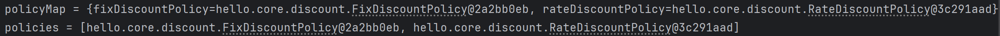

# 📌 목차
- 다양한 의존관계 주입 방법
- 옵션 처리
- 생성자 주입을 선택해라!
- 롬복과 최신 트랜드
- 조회 빈이 2개 이상 - 문제
- @Autowired 필드 명, @Qualifier, @Primary
- 애노테이션 직접 만들기
- 조회한 빈이 모두 필요할 때, List, Map
- 자동, 수동의 올바른 실무 운영 기준
# 💡 의존 관계 주입 방법
의존관계 주입은 크게 4가지 방법이 있다.
- 생성자 주입
- 수정자 주입(setter 주입)
- 필드 주입
- 일반 메서드 주입

보통 생성자 주입을 사용한다.
이제 각 주입에 대해 살펴보자.
### 생성자 주입
- 생성자 호출 시점에 딱 1번만 호출되는 것이 보장되는 방식
- 불변, 필수 의존관계에 사용한다.
	- `final` 필드여야만 함(불변)

``` java
@Component
public class OrderServiceImpl implements OrderService{

    private final MemberRepository memberRepository;
    private final DiscountPolicy discountPolicy;

    @Autowired
    public OrderServiceImpl(MemberRepository memberRepository, DiscountPolicy discountPolicy) {
        this.memberRepository = memberRepository;
        this.discountPolicy = discountPolicy;
	}
}
```

- 생성자가 딱 1개만 있으면 `@Autowired`를 생략해도 자동 주입 된다.

``` java
@Component
public class OrderServiceImpl implements OrderService{

    private final MemberRepository memberRepository;

    public OrderServiceImpl(MemberRepository memberRepository, DiscountPolicy discountPolicy) {
        this.memberRepository = memberRepository;
}
```

##### 생성자 주입 애노테이션 - @RequiredArgsConstructor
- `@RequiredArgsConstructor`은 생성자 주입을 자동으로 해주는 어노테이션이다.
- `@RequiredArgsConstructor`을 사용하면 필드만 선언하고 생성자 주입 코드는 생략할 수 있다.

``` java
@Component
@RequiredArgsConstructor
public class OrderServiceImpl implements OrderService{

    private final MemberRepository memberRepository;
    private final DiscountPolicy discountPolicy;
}
```

### 수정자 주입(setter 주입)
- 필드의 값을 변경하는 수정자 메서드를 통해서 의존관계를 주입하는 방법
- 수정자 메서드를 보통 setter라고 부르며 `@Setter` 어노테이션으로 대체 가능하다.
- 특징
	- 선택, 변경 가능성이 있는 의존관계에서 사용
	- 자바빈 프로퍼티 규약의 수정자 메서드 방식을 사용하는 방법이다.
> 자바빈 프로퍼티이란?
> 필드의 값을 직접 변경하지 않고, setXxx, getXxx 라는 메서드를 통해서 값을 읽거나 수정하는 규칙

``` java
@Component
public class OrderServiceImpl implements OrderService {

	private MemberRepository memberRepository;
	private DiscountPolicy discountPolicy;
	
	@Autowired
	public void setMemberRepository(MemberRepository memberRepository) { 
		this.memberRepository = memberRepository;
	}
	
	@Autowired public void setDiscountPolicy(DiscountPolicy discountPolicy) { 
		this.discountPolicy = discountPolicy;
	}
}
```

### 필드 주입
- 말 그대로 필드에 바로 주입하는 방식
- 특징
	- 코드가 간결하지만 외부에서 변경이 불가능해서 테스트 하기 힘들다는 치명적 단점 존재
	- DI 프레임워크 없으면 아무것도 할 수 없음
	- 걍 사용하지 말자. 안좋은 방법임
	- 대신 실제 코드와 관련 없는 테스트 코드에서 테스트 용도로 사용하거나
	- 스프링 설정 목적으로 하는 `@Configuration` 같은 곳에서만 특별한 용도로 사용하자

``` java
@Component
public class OrderServiceImpl implements OrderService {
	@Autowired private MemberRepository memberRepository;
	@Autowired private DiscountPolicy discountPolicy;
}
```

### 일반 메서드 주입
- 일반 메서드를 통해 주입 받는 방식
- 한번에 여러 필드를 주입 받을 수 있지만 일반적으로 사용하지 않는다.

``` java
@Component
public class OrderServiceImpl implements OrderService {
	private MemberRepository memberRepository;
	private DiscountPolicy discountPolicy;
	
	@Autowired
	public void init(MemberRepository memberRepository, DiscountPolicy discountPolicy) {
		this.memberRepository = memberRepository;
		this.discountPolicy = discountPolicy;
	}
}
```
# 💡 옵션 처리
- `@Autowired`만 사용하면 required 옵션의 기본값이 true로 되어 있어서 자동 주입 대상이 없으면 오류가 발생한다.
- 오류를 방지하고 주입할 스프링 빈이 없어도 동작할 수 있는 옵션을 설정해서 처리할 수 있다.
- 주입할 스프링 빈이 없어도 동작해야 할 때 사용하는 옵션
	- `@Autowired(required=false)` : 자동 주입할 대상이 없으면 수정자 메서드 자체가 호출 안됨
	- `org.springframework.lang.@Nullable` : 자동 주입할 대상이 없으면 null이 입력된다. 
	- `Optional<>` : 자동 주입할 대상이 없으면 `Optional.empty` 가 입력된다

``` java
// Member는 스프링 컨테이너에 등록된 스프링 빈이 아니다.

// 주입할 대상인 Member가 없으므로 호출되지 않는다.
@Autowired(required = false)
public void setNoBean1(Member member){
    System.out.println("Bean1 = " + member);
    // 메소드가 호출되지 않아서 출력되지 않음
}

@Autowired
public void setNoBean2(@Nullable Member member){
    System.out.println("Bean2 = " + member);
    // 출력: setNoBean2 = null
}

@Autowired
public void setNoBean3(Optional<Member> member){
    System.out.println("Bean3 = " + member);
    // 출력: 출력결과** ``` setNoBean2 = null setNoBean3 = Optional.empty
}
```

# 💡 생성자 주입을 선택해라
- DI 프레임워크 대부분은 생성자 주입을 권장한다.
- 그 이유를 알아보자.
### 불변
- 대부분의 의존관계 주입은 한번 일어나면 애플리케이션 종료시점까지 의존관계를 변경할 일이 없다. 오히려 대부 분의 의존관계는 애플리케이션 종료 전까지 변하면 안된다.(불변해야 한다.)
- 수정자 주입을 사용하면, setXxx 메서드를 public으로 열어두어야 한다.
	- 누군가 실수로 변경할 수 도 있고, 변경하면 안되는 메서드를 열어두는 것은 좋은 설계 방법이 아니다.
- 생성자 주입은 객체를 생성할 때 딱 1번만 호출되므로 이후에 호출되는 일이 없다.
- 따라서 불변하게 설계할 수 있다.
### 누락

#### 설정자 주입 사용

``` java
public class OrderServiceImpl implements OrderService{
    private MemberRepository memberRepository;
    private DiscountPolicy discountPolicy;

	@Autowired
    public void setMemberRepository(MemberRepository memberRepository) {
        this.memberRepository = memberRepository;
    }

    @Autowired
    public void setDiscountPolicy(DiscountPolicy discountPolicy) {
        this.discountPolicy = discountPolicy;
    }

    @Override
    public Order createOrder(Long memberId, String itemName, int itemPrice) {
        Member member = memberRepository.findById(memberId);
        int discount = discountPolicy.discount(member, itemPrice);

        return new Order(memberId, itemName, itemPrice, discount);
    }
```

- `createOrder()`를 호출하기 위해선 `memberRepository`, `discountPolicy`가 필요한데 값이 설정되지 않았기 때문에 `NullPointerException`이 발생한다.
``` java
@Test
    void createOrder() {
        OrderServiceImpl orderService = new OrderServiceImpl();
        orderService.createOrder(1L, "itemA", 10000);
    }
```

#### 생성자 주입 사용
- 생성자 주입을 사용할 경우 주입 데이터를 누락 했을 때 컴파일 오류가 발생한다.
- 그리고 IDE에서 바로 어떤 값을 필수로 주입해야 하는지 알 수 있다.

``` java
public class OrderServiceImpl implements OrderService{
    private final MemberRepository memberRepository;
    private final DiscountPolicy discountPolicy;

	@Autowired
    public OrderServiceImpl(MemberRepository memberRepository, DiscountPolicy discountPolicy) {
        this.memberRepository = memberRepository;
        this.discountPolicy = discountPolicy;
    }

    @Override
    public Order createOrder(Long memberId, String itemName, int itemPrice) {
        Member member = memberRepository.findById(memberId);
        int discount = discountPolicy.discount(member, itemPrice);

        return new Order(memberId, itemName, itemPrice, discount);
    }
```

- 생성자를 통해 `memberRepository`, `discountPolicy`를 설정해줬기 때문에 정상 실행된다.

``` java
@Test
    void createOrder() {
        OrderServiceImpl orderService = new OrderServiceImpl(memberRepository, new FixDiscountPolicy());
        Order order = orderService.createOrder(1L, "itemA", 10000);
        assertThat(order.getDiscountPrice()).isEqualTo(1000);

    }
```

#### final 키워드 - 생성자만 사용 가능
- 설정자 주입과 다르게 생성자 주입은 필드에 final 키워드를 사용할 수 있다.
 - 설정자 주입은 객체 생성 후 set 메소드를 통해 필드를 설정해야 하지만 객체 생성과 동시에 필드 값을 설정하기 때문이다.

- 아래 코드처럼 `discountPolicy`에 값을 설정하는 부분이 누락되었을 경우 컴파일 시점에 다음 오류를 발생시킨다.
	- `java: variable discountPolicy might not have been initialized`

``` java
@Component
public class OrderServiceImpl implements OrderService {

    private final MemberRepository memberRepository;
    private final DiscountPolicy discountPolicy;

    @Autowired
    public OrderServiceImpl(MemberRepository memberRepository, DiscountPolicy discountPolicy) {
    this.memberRepository = memberRepository;
    //컴파일 오류 발생
    }
}
```

#### 정리
- 생성자 주입을 사용하는 이유
	- 프레임 워크에 의존하지 않고 순수 자바 언어의 특징을 가장 잘 살리는 방법
- 기본으로 생성자 주입 사용하고, 필수 값이 아닌 경우에는 수정자 주입을 사용할 수 있다.
- 따라서 항상 생성자 주입을 사용하고 추가적인 옵션만 설정자 주입을 사용한다. 필드 주입은 사용하지 말자.

# 💡 롬복과 최신 트렌드
- 막상 개발을 해보면, 대부분이 다 불변이고, 그래서 다음과 같이 필드에 final 키워드를 사용하게 된다.
- 그런데 생성자도 만들고 주입 받은 값을 대입하는 코드도 만들어야 한다.
- 롬복을 이용하면 필드 주입을 편리하게 사용할 수 있다.
	- `@RequiredArgsConstructor`
		- final이 붙은 필드들을 모아서 생성자를 자동으로 만든다.
		- 단 생성자가 하나일 때만 `@Autowired`를 생략할 수 있기 때문에 사용 가능하다.

### 롬복 사용X

``` java
@Component
public class OrderServiceImpl implements OrderService {
    private final MemberRepository memberRepository;
    private final DiscountPolicy discountPolicy;

    @Autowired
    public OrderServiceImpl(MemberRepository memberRepository, DiscountPolicy discountPolicy) {
    this.memberRepository = memberRepository;
    this.discountPolicy = discountPolicy;
    }
}
```

### 롬복 사용O

``` java
@Component
@RequiredArgsConstructor
    public class OrderServiceImpl implements OrderService {
        private final MemberRepository memberRepository;
        private final DiscountPolicy discountPolicy;
}
```

`@RequiredArgsConstructor`를 사용하면 final 필드들을 모아 하나의 생성자를 만들어주고 생성자가 하나만 있을 경우 `@Autowired`를 생략할 수 있으니 `@RequiredArgsConstructor`만으로 코드를 간결하게 만들 수 있다.

# 💡 조회 빈이 2개 이상인 경우
- `@Autowired`는 타입(Type)으로 조회한다.
- 때문에 타입으로 조회하면 선택된 빈이 2개 이상일 때 문제가 발생한다.
- 다음 예시를 통해 확인해보자

- `DiscountPolicy`를 상속 받는 두 클래스가 `RateDiscountPolicy`, `FixDiscountPolicy` 모두 스프링 빈으로 등록되어 있다고 가정해보자.

``` java
@Component
public class RateDiscountPolicy implements DiscountPolicy {

@Component
public class FixDiscountPolicy implements DiscountPolicy{
```

- `DiscountPolicy`와 의존 관계가 있는 `OrderServiceImpl`를 불러오면 `NoUniqueBeanDefinitionException` 오류가 발생한다.
- 왜냐하면 `OrderServiceImpl`에서는 한 개의 `DiscountPolicy` 빈을 조회해야 하는데 스프링 컨테이너에는 `RateDiscountPolicy`와 `FixDiscountPolicy` 총 두 개의 `DiscountPolicy` 빈이 존재하기 때문이다.

``` java
@Test
    void basicScan() {
        ApplicationContext ac = new AnnotationConfigApplicationContext(AutoAppConfig.class);

        MemberService memberService = ac.getBean(MemberService.class);
        assertThat(memberService).isInstanceOf(MemberService.class);

        OrderServiceImpl bean = ac.getBean(OrderServiceImpl.class);
        MemberRepository memberRepository = bean.getMemberRepository();
        System.out.println("memberRepository = " + memberRepository);

    }
```

- 이때 하위 타입으로 지정할 수도 있지만 이는 DIP를 위배하고 유연성이 떨어진다.
- 그리고 이름만 다르고, 완전히 똑같은 타입의 스프링 빈이 2개 있을 때는 해결이 되지 않는다.
- 이 문제를 해결하는 방법을 알아보자.
# 💡 @Autowired 필드 명, @Qualifier, @Primary
조회 빈이 2개 이상일 경우에 생기는 문제는 다음 세 가지를 통해 해결할 수 있다.
### @Autowired 필드 명 매칭
> 먼저 타입 매칭을 시도하고, 여러 빈이 있다면 필드 이름, 파라미터 이름으로 빈 이름을 추가 매칭하여 같은 이름의 빈이 있다면 그 빈을 가져와 주입한다.

- 이름을 `discountPolicy`로 선언하면 타입으로 조회시 두 개의 빈이 조회 되었을 때 오류를 발생시킨다.
- 하지만 이름을 `rateDiscountPolicy`로 선언하면 타입으로 조회시 두 개의 빈이 조회 되었을 때 이름과 동일한 빈이 있는지 조회하고 있다면 그 빈을 가져와 주입한다.

``` java
// 필드 주입
@Autowired
private DiscountPolicy discountPolicy

@Autowired
private DiscountPolicy rateDiscountPolicy

// 생성자 주입
@Autowired
public OrderServiceImpl(MemberRepository memberRepository, DiscountPolicy discountPolicy) {
	this.memberRepository = memberRepository;
	this.discountPolicy = discountPolicy;
}

@Autowired
public OrderServiceImpl(MemberRepository memberRepository, DiscountPolicy rateDiscountPolicy) {
	this.memberRepository = memberRepository;
	this.discountPolicy = rateDiscountPolicy;
}
```

### @Qualifier 사용
> 스프링 빈에 추가 구분자를 붙여주는 방법(빈 이름을 바꾸는 것은 아님)

- 스프링 빈에 `@Qualifier`를 이용하여 추가 구분자를 붙여준다.
- `@Autowired`로 의존 관계 주입을 할 때 추가 구분자를 이용하여 해당 빈을 주입한다.
- 만약 해당 추가 구분자를 갖고 있는 스프링 빈을 찾지 못한다면 추가 구분자를 이름으로 사용하는 스프링 빈을 추가로 찾는다.
	- `@Qualifier("mainDiscountPolicy")`를 못찾으면 `mainDiscountPolicy`라는 이름의 스프링 빈을 추가로 찾는다.
	- `@Qualifier`는 `@Qualifier`를 찾는 용도로만 사용하는 게 명확하고 좋기 때문에 이 방법은 좋지 않은 방법이다.

- `@Qualifier("추가구분자")`

``` java
@Component
@Qualifier("mainDiscountPolicy")
public class RateDiscountPolicy implements DiscountPolicy {}

@Component
@Qualifier("fixDiscountPolicy")
public class FixDiscountPolicy implements DiscountPolicy{
```


- 생성자 자동 주입

``` java
@Autowired
public OrderServiceImpl(MemberRepository memberRepository, @Qualifier("mainDiscountPolicy") DiscountPolicy discountPolicy) {
	this.memberRepository = memberRepository;
	this.discountPolicy = discountPolicy;
}
```

- 수정자 자동 주입

``` java
@Autowired
public void setDiscountPolicy(@Qualifier("mainDiscountPolicy") DiscountPolicy discountPolicy) {
	this.discountPolicy = discountPolicy;
}
```

### @Primary 사용
> 스프링 빈 사이에서 우선순위를 정하는 방법


- `@Primary`로 `RateDiscountPolicy`를 우선순위로 설정했다.
- 따라서 두 개 이상의 빈이 조회 될 경우 그중 우선순위로 설정된 빈을 주입한다.

``` java
@Component
@Primary
public class RateDiscountPolicy implements DiscountPolicy {}

@Component
public class FixDiscountPolicy implements DiscountPolicy{
```

- 생성자 자동 주입

``` java
@Autowired
public OrderServiceImpl(MemberRepository memberRepository, DiscountPolicy discountPolicy) {
	this.memberRepository = memberRepository;
	this.discountPolicy = discountPolicy;
    }
```

- 수정자 자동 주입

``` java
@Autowired
public void setDiscountPolicy(DiscountPolicy discountPolicy) {
	this.discountPolicy = discountPolicy;
}
```

### @Primary, @Qualifier 장단점 및 활용
#### @Primary, @Qualifier 장단점
- `@Qualifier`는 매우 상세하게 동작한다는 장점이 있지만 주입 받을 때 모든 코드에 `@Qualifier`를 붙여줘야하는 단점이 있다.
- 반면 `@Primary`는  `@Qualifier`를 붙일 필요 없이 우선순위가 가장 높은 빈에만 붙여주면 돼서 편하다는 장점이 있지만 상세하게 설정이 불가능하다는 단점이 있다.
- 그렇다면 언제 어떤 것을 사용하는 게 좋을까? 다음 상황을 통해 확인해보자.

#### @Primary, @Qualifier 활용
- 예시
	- 메인 데이터베이스에서 커넥션을 획득하는 스프링 빈이 있고, 서브 데이터베이스의 커넥션을 획득하는 스프링 빈이 있다고 생각해보자.
	- 메인 데이터베이스의 커넥션을 획득하는 스프링 빈은 `@Primary` 를 적용해서 조회하는 곳에서 `@Qualifier` 지정 없이 편리하게 조회하고, 서브 데이터베 이스 커넥션 빈을 획득할 때는 `@Qualifier` 를 지정해서 명시적으로 획득 하는 방식으로 사용하면 코드를 깔끔하게 유지할 수 있다.
		-  물론 메인 데이터베이스의 스프링 빈을 등록할 때 `@Qualifier` 를 지정해주는 것은 상관없다

### @Primary, @Qualifier 우선순위
- `@Primary` 는 기본값 처럼 동작하는 것이고, `@Qualifier` 는 매우 상세하게 동작한다.
- 스프링은 자동보다는 수동이, 넒은 범위의 선택권 보다는 좁은 범위의 선택권이 우선 순위가 높다.
- 따라서 여기서도 `@Qualifier` 가 우선권이 높다
# 💡 애노테이션 직접 만들기
- `@Qualifier("mainDiscountPolicy")` 이렇게 문자를 적으면 컴파일시 타입 체크가 안된다.
	- 예를 들어 `@Qualifier("mainnnnnDiscountPolicy")`와이 추가 구분자를 잘못 적더라도 동작되고 오류를 잡을 수 없다.
- 이러한 오류를 다음과 같은 애노테이션을 만들어서 문제를 해결할 수 있다
- [어노테이션 정리](https://tojaman.tistory.com/158#%EC%96%B4%EB%85%B8%ED%85%8C%EC%9D%B4%EC%85%98-1)

- 다음과 같이 어노테이션을 선언하고 사용할 수 있다.

``` java
@Target({ElementType.FIELD, ElementType.METHOD, ElementType.PARAMETER, ElementType.TYPE, ElementType.ANNOTATION_TYPE})
@Retention(RetentionPolicy.RUNTIME)
@Inherited
@Documented
@Qualifier("mainDiscountPolicy")
public @interface MainDiscountPolicy {
}
```

``` java
@Component
@MainDiscountPolicy
public class RateDiscountPolicy implements DiscountPolicy {
```
# 💡 조회한 빈이 모두 필요할 때, List, Map
- 해당 타입의 빈이 모두 필요할 경우도 있다.
- 예를 들어 할인 서비스를 제공하는데 회원이 할인의 종류(rate, fix)를 선택할 수 있다고 가정해보자.
- 이때 List와 Map을 사용해서 두 빈 모두 가져와 선택하게 할 수 있다.

``` java
public class AllBeanTest {

    @Test
    void findAllBean() {
        // 스프링 컨테이너 생성, 스프링 빈(AutoAppConfig, DiscountService) 생성
        ApplicationContext ac = new AnnotationConfigApplicationContext(AutoAppConfig.class, DiscountService.class);

        // DiscountService 빈 가져오기
        DiscountService discountService = ac.getBean(DiscountService.class);

        // 테스트용 Member 생성
        Member member = new Member(1L, "userA", Grade.VIP);

        // 할인 정책 적용
        int FixDiscountPrice = discountService.discount(member, 1000, "fixDiscountPolicy");

        // 검증 - 코드 요약: Alt + Enter
        assertThat(discountService).isInstanceOf(DiscountService.class);
        assertThat(FixDiscountPrice).isEqualTo(1000);

        int RateDiscountPrice = discountService.discount(member, 20000, "rateDiscountPolicy");
        assertThat(RateDiscountPrice).isEqualTo(2000);
    }

    static class DiscountService {

        private final Map<String, DiscountPolicy> policyMap;
        private final List<DiscountPolicy> policies;

        // 생성자 주입
        public DiscountService(Map<String, DiscountPolicy> policyMap, List<DiscountPolicy> policies) {
            this.policyMap = policyMap;
            this.policies = policies;

            // 의존성 확인 출력
            System.out.println("policyMap = " + policyMap);
            System.out.println("policies = " + policies);
        }

        public int discount(Member member, int price, String discountCode) {
            // 코드에 해당하는 DiscountPolicy 가져오기
            DiscountPolicy discountPolicy = policyMap.get(discountCode);

            // 디버깅 출력
            System.out.println("discountCode = " + discountCode);
            System.out.println("discountPolicy = " + discountPolicy);

            // 할인 적용 및 반환
            return discountPolicy.discount(member, price);
        }
    }
}
```

### 로직 분석
-  `DiscountService`는 Map으로 `fixDiscountPolicy`, `rateDiscountPolicy` 두 종류 모두 주입된다.
- `discount()` 메서드는 `discountCode`로 `fixDiscountPolicy`, `rateDiscountPolicy`가 넘어오면서 map에서 `fixDiscountPolicy`나 `rateDiscountPolicy`를 찾아서 실행한다.
	- 이때 `discountCode`는 두 클래스의 `@Qualifier`로 선언한 구분자를 의미한다.
### 주입 분석
- `Map<String, DiscountPolicy>` : map의 키에 스프링 빈의 이름을 넣어주고, 그 값으로 `DiscountPolicy` 타입으로 조회한 모든 스프링 빈을 담아준다.
- `List<DiscountPolicy>` : `DiscountPolicy` 타입으로 조회한 모든 스프링 빈을 담아준다
- 만약 해당하는 타입의 스프링 빈이 없으면, 빈 컬렉션이나 Map을 주입한다.



# 💡 자동, 수동의 올바른 실무 운영 기준
> 어떤 경우에 컴포넌트 스캔과 자동 주입을 사용하고, 어떤 경우에 설정 정보를 통해서 수동으로 빈을 등록하고, 의존관계도 수동으로 주입해야 할까?
### 편리한 자동 기능을 기본으로 사용하자
- 스프링이 나오고 시간이 갈 수록 점점 자동을 선호하는 추세다.
- 스프링은 `@Component` 뿐만 아 니라 `@Controller` , `@Service` , `@Repository` 처럼 계층에 맞추어 일반적인 애플리케이션 로직을 자동으로 스캔할 수 있도록 지원한다.
- 거기에 더해서 최근 스프링 부트는 컴포넌트 스캔을 기본으로 사용하고, 스프링 부트의 다양 한 스프링 빈들도 조건이 맞으면 자동으로 등록하도록 설계했다.
- 설정 정보를 기반으로 애플리케이션을 구성하는 부분과 실제 동작하는 부분을 명확하게 나누는 것이 이상적이지만, 개발자 입장에서 스프링 빈을 하나 등록할 때 `@Component` 만 넣어주면 끝나는 일을 `@Configuration` 설정 정보에 가서 `@Bean` 을 적고, 객체를 생성하고, 주입할 대상을 일일이 적어주는 과정은 상당히 번거롭다.
- 또 관리할 빈이 많아서 설정 정보가 커지면 설정 정보를 관리하는 것 자체가 부담이 된다.
- 그리고 결정적으로 **자동 빈 등록을 사용해도 OCP, DIP를 지킬 수 있다.**

### 그러면 수동 빈 등록은 언제 사용하면 좋을까?
어플리케이션은 크게 업무 로직과 지원 로직으로 나눌 수 있다.
- **업무 로직 빈**
	- 웹을 지원하는 **컨트롤러**, 핵심 비즈니스 로직이 있는 **서비스**, 데이터 계층의 로직을 처리하는 **리포지토리** 등이 모두 업무 로직이다. 보통 비즈니스 요구사항을 개발할 때 추가되거나 변경된다.
- **기술 지원 빈**
	- **기술적인 문제**나 **공통 관심사**(**AOP**)를 처리할 때 주로 사용된다. 데이터베이스 연결이나, 공통 로그 처리 처럼 업무 로직을 지원하기 위한 하부 기술이나 공통 기술들이다
#### 1. 기술 지원 빈을 등록할때 사용
- 업무 로직
	- 숫자도 매우 많고, 한번 개발해야 하면 컨트롤러, 서비스, 리포지토리 처럼 어느정도 유사한 패턴이 있다. 이런 경우 **자동 기능**을 적극 사용하는 것이 좋다. 보통 문제가 발생해도 어떤 곳에서 문제가 발생했는지 명확하게 파악하기 쉽다.
- 기술 지원 로직
	- 업무 로직과 비교해서 그 수가 매우 적고, 보통 애플리케이션 전반에 걸쳐서 광범위하게 영향을 미친다. 그리고 업무 로직은 문제가 발생했을 때 어디가 문제인지 명확하게 잘 드러나지만, 기술 지원 로직은 적용 이 잘 되고 있는지 아닌지 조차 파악하기 어려운 경우가 많다. 그래서 이런 기술 지원 로직들은 가급적 **수동 빈 등록**을 사용해서 명확하게 드러내는 것이 좋다

**애플리케이션에 광범위하게 영향을 미치는 기술 지원 객체는 수동 빈으로 등록해서 딱! 설정 정보에 바로 나타나게 하는 것이 유지보수 하기 좋다**

#### 2. 비즈니스 로직 중에서 다형성을 적극 활용할 때
- 의존관계 자동 주입 - 조회한 빈이 모두 필요할 때, List, Map을 다시 보자.
- `DiscountService` 가 의존관계 자동 주입으로 `Map<String, DiscountPolicy>` 에 주입을 받는 상황을 생각 해보자.
- 여기에 어떤 빈들이 주입 될 지, 각 빈들의 이름은 무엇일지 코드만 보고 한번에 쉽게 파악할 수 있을까? 내가 개 발했으니 크게 관계가 없지만, 만약 이 코드를 다른 개발자가 개발해서 나에게 준 것이라면 어떨까?
- 자동 등록을 사용하고 있기 때문에 파악하려면 여러 코드를 찾아봐야 한다.
- 이런 경우 수동 빈으로 등록하거나 또는 자동으로 하면 **특정 패키지에 같이 묶어** 두는게 좋다! 핵심은 딱 보고 이해가 되어야 한다!

- 이 부분을 별도의 설정 정보로 만들고 수동으로 등록하면 다음과 같다

``` java
@Configuration
public class DiscountPolicyConfig {
    @Bean
    public DiscountPolicy rateDiscountPolicy() {
    return new RateDiscountPolicy();
    }

    @Bean
    public DiscountPolicy fixDiscountPolicy() {
    return new FixDiscountPolicy();
    }
}
```

- 이 설정 정보만 봐도 한눈에 빈의 이름은 물론이고, 어떤 빈들이 주입될지 파악할 수 있다.
- 그래도 빈 자동 등록을 사용 하고 싶으면 파악하기 좋게 `DiscountPolicy` 의 구현 빈들만 따로 모아서 특정 패키지에 모아두자

### 정리
- 편리한 자동 기능을 기본으로 사용하자
- 직접 등록하는 기술 지원 객체는 수동 등록
- 다형성을 적극 활용하는 비즈니스 로직은 수동 등록을 고민해보자
