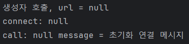
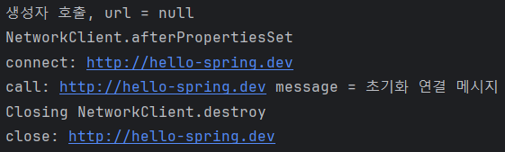
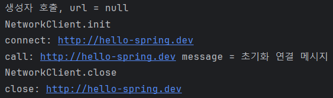
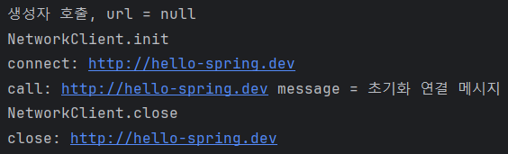

# 📌 목차
- 빈 생명주기 콜백 시작
- 인터페이스 InitializingBean, DisposableBean
- 빈 등록 초기화, 소멸 메서드
- 애노테이션 @PostConstruct, @PreDestroy

# 💡 빈 생명주기 콜백 시작
데이터베이스 커넥션 풀이나, 네트워크 소켓처럼 애플리케이션 시작 시점에 필요한 연결을 미리 해두고, 애플리케이션 종료 시점에 연결을 모두 종료하는 작업을 진행하려면, 객체의 초기화와 종료 작업이 필요하다.
스프링을 통해 이러한 초기화 작업과 종료 작업을 어떻게 진행하는지 알아보자.

# 외부 네트워크에 미리 연결하는 객체 생성
외부 네트워크에 미리 연결하는 객체를 하나 생성한다는 가정하에 테스트 코드를 작성해보자.
실제로 생성하는 것은 아니고 가정만 하는 것이다.

- 외부 url에 연결하는 클라이언트 클래스

``` java
public class NetworkClient {

    private String url;

    public NetworkClient() {
        System.out.println("생성자 호출, url = " + url);
        connect();
        call("초기화 연결 메시지");
    }

    public void setUrl(String url) {
        this.url = url;
    }

    // 서비스 시작시 호출
    public void connect() {
        System.out.println("connect: " + url);
    }

    public void call(String message) {
        System.out.println("call: " +url + " message = " + message);
    }

    // 서비스 종료시 호출
    public void disconnect() {
        System.out.println("close: " +url);
    }
}

```

- 외부 네트워크에 연결하는 테스트 코드

``` java
public class BeanLifeCycleTest {

    @Test
    public void lifeCycleTest() {
        ConfigurableApplicationContext ac = new AnnotationConfigApplicationContext(LifeCycleConfig.class);
        NetworkClient client = ac.getBean(NetworkClient.class);
        ac.close(); // 스프링 컨테이너를 종료, ConfigurableApplicationContext 필요
    }

    @Configuration
    static class LifeCycleConfig {

        @Bean
        public NetworkClient networkClient() {
            NetworkClient networkClient = new NetworkClient();
            networkClient.setUrl("http://hello-spring.dev");
            return networkClient;
        }
    }


}

```

위 테스트 코드를 실행하면 다음과 같은 결과가 나온다.


수정자 주입 메서드인 `setUrl()` 메서드로 의존관계를 주입하기 전 출력한 메시지이므로 당연한 결과이다.
스프링 빈은 객체를 생성하고, 의존관계 주입이 끝난 뒤 필요한 데이터를 사용할 수 있는 준비가 완료된다.
### 개발자는 이 시점을 어떻게 알 수 있을까?
스프링 의존관계 주입이 완료되면 스프링 빈에게 **콜백 메서드를 통해서 초기화 시점을 알려주는 다양한 기능**을 제공한다.
또한 스프링은 스프링 컨테이너가 종료되기 직전에 **소멸 콜백**을 준다.

- 스프링 빈의 이벤트 라이프사이클
	- **스프링 컨테이너 생성** → **스프링 빈 생성** → **의존관계 주입** → **초기화 콜백** → **사용** → **소멸전 콜백** → **스프링 종료
		- **초기화 콜백**: 빈이 생성되고 의존관계 주입이 완료된 후 호출
		- **소멸전 콜백**: 빈이 소멸되기 직전 콜백

### 객체의 생성과 초기화 분리
**생성자**는 필수 정보(파라미터)를 받고, 메모리를 할당해서 **객체를 생성**하는 책임을 가진다.
반면 **초기화**는 생성된 값들을 활용해서 **외부 커넥션을 연결하는 등 무거운 동작**을 수행한다.
따라서 생성자 안에서 무거운 초기화 작업을 함께 하는 것 보다는 **객체를 생성하는 부분과 초기화 하는 부분을 명확하게 나누는 것**이 **유지보수 관점에서 좋다**.
물론 초기화 작업이 내부 값들을 약간 변경하는 정도로 단순한 경우에는 생성자에서 한번에 다 처리하는 게 더 나을 수도 있다.

> 💡 **생명주기가 짧은 빈(컨테이너 종료 전에 미리 소멸하는 빈)**
> 컨테이너의 시작과 종료까지 생존하는 빈들과 다르게 생명주기가 짧은 빈들도 있다.
> 이러한 빈들은 컨테이너와 무관하게 해당 빈이 종료되기 직전에 소멸전 콜백이 일어난다. 이는 다음 장인 빈 스코프에서 알아보자.

### 3가지 빈 생명주기 콜백
- 인터페이스(`InitializingBean`, `DisposableBean`)
- 설정 정보에 초기화 메서드, 종료 메서드 지정
- `@PostConstruct`, `@PreDestroy` 애노테이션 지원

다음 세 가지 빈 생명주기 콜백에 대해서 알아보자.
# 💡 인터페이스 InitializingBean, DisposableBean
`InitializingBean`, `DisposableBean` 인터페이스를 이용하여 초기화 콜백과 소멸전 콜백을 구현해보자.

- `InitializingBean` 인터페이스가 제공하는 `afterPropertiesSet()`을 오버라이딩하여 초기화 콜백 메서드 구현
- `DisposableBean` 인터페이스가 제공하는 `destroy()`를 오버라이딩하여 소멸 전 콜백  메서드 구현

``` java
public class NetworkClient implements InitializingBean, DisposableBean {

    private String url;

    public NetworkClient() {
        System.out.println("생성자 호출, url = " + url);
    }

    public void setUrl(String url) {
        this.url = url;
    }

    // 서비스 시작시 호출
    public void connect() {
        System.out.println("connect: " + url);
    }

    public void call(String message) {
        System.out.println("call: " + url + " message = " + message);
    }

    // 서비스 종료시 호출
    public void disConnect() {
        System.out.println("close: " + url);
    }

    // InitializingBean 인터페이스: 메소드 초기화 콜백
    @Override
    public void afterPropertiesSet() throws Exception {
        System.out.println("NetworkClient.afterPropertiesSet");
        connect();
        call("초기화 연결 메시지");
    }

    // DisposableBean 인터페이스: 메소드 소멸전 콜백
    @Override
    public void destroy() throws Exception {
        System.out.println("Closing NetworkClient.destroy");
        disConnect();
    }
}

```

``` java
@Configuration
static class LifeCycleConfig {

	@Bean
	public NetworkClient networkClient() {
		NetworkClient networkClient = new NetworkClient();
		networkClient.setUrl("http://hello-spring.dev");
		return networkClient;
	}
}
```

- 출력 결과


### 초기화, 소멸 인터페이스 단점
- 두 인터페이스는 스프링 전용 인터페이스라서 해당 코드가 스프링 전용 인터페이스에 의존한다.
- 초기화 소멸 메서드를 오버라이딩하여 사용하기 때문에 이름을 변경할 수 없다.
- 내가 코드를 고칠 수 없는 외부 라이브러리에 적용할 수 없다.
	- InitializingBean과 DisposableBean를 구현하도록 대상 클래스를 지정해줘야 한다.
	- 하지만 외부 라이브러리들은 이미 컴파일된 상태이기 때문에 코드 변경이 불가능하다.
		- 해당 라이브러리 클래스에 implements InitializingBean, DisposableBean를 해서 초기화, 소멸 메서드를 오버라이딩해야 하는데 이게 불가능하다는 뜻이다.

> 이 방법은 스프링 초창기에 나온 방법들이고, 지금은 더 나은 방법들이 있어서 거의 사용하지 않는다.
# 💡 빈 등록 초기화, 소멸 메서드
빈을 등록할 때 설정 정보에 `@Bean(initMethod = "init", destroyMethod = "close")` 처럼 초기화, 소멸 메서드를 지정할 수 있다

- 초기화 메서드 - `init()`
- 소멸 메서드 - `close()`

``` java
public class NetworkClient {
    private String url;

    public NetworkClient() {
        System.out.println("생성자 호출, url = " + url);
    }

    public void setUrl(String url) {
        this.url = url;
    }

    // 서비스 시작시 호출
    public void connect() {
        System.out.println("connect: " + url);
    }

    public void call(String message) {
        System.out.println("call: " + url + " message = " + message);
    }

    // 서비스 종료시 호출
    public void disConnect() {
        System.out.println("close: " + url);
    }

    public void init() {
        System.out.println("NetworkClient.init");
        connect();
        call("초기화 연결 메시지");
    }

    public void close() {
        System.out.println("NetworkClient.close");
        disConnect();
    }
```

- 설정 정보에 초기화 소멸 메서드 지정

``` java
@Configuration
static class LifeCycleConfig {

	@Bean(initMethod = "init", destroyMethod = "close")
	public NetworkClient networkClient() {
		NetworkClient networkClient = new NetworkClient();
		networkClient.setUrl("http://hello-spring.dev");
		return networkClient;
	}
}
```

- 결과


### 설정 정보 사용 특징
- 메서드 이름을 자유롭게 설정할 수 있다.
	- 인터페이스 방식은 오버라이딩을 하기 때문에 설정이 불가능하지만 이 방식은 개발자가 직접 구현하는 메소드이기 때문에 자유롭게 설정 가능
- 스프링 빈이 스프링 코드에 의존하지 않는다.
	- 인터페이스 방식과 다르게 스프링 코드를 사용하지 않기 때문
- 코드가 아니라 설정 정보를 사용하기 때문에 코드를 고칠 수 없는 외부 라이브러리에도 초기화, 종료 메서드를 적용할 수 있다.
	- 인터페이스 방식과 다르게 코드를 고칠 필요가 없기 때문에 가능
### 종료 메서드 추론
- `@Bean의 destroyMethod` 속성에는 아주 특별한 기능이 있다
	- `String destroyMethod() default "(inferred)";`
	- 위처럼 `destroyMethod`의 디폴트 값이 `inferred`로 되어 있다.
	- 이 추론(`inferred`) 기능은 `close`, `shutdown`이라는 이름의 종료 메서드가 있다면 찾아서 그 메소드를 자동으로 호출해주는 기능이다.
	- 따라서 종료 메서드를 `close`나 `shutdown`으로 지정했다면 `destroyMethod`를 따로 적어주지 않아도 된다.
		- `@Bean(initMethod = "init", destroyMethod = "close")`가 아닌
		- `@Bean(initMethod = "init")`만 적어도 정상 작동한다.
- 추론 기능을 사용하기 싫으면 `destroyMethod=""` 처럼 빈 공백을 지정하면 된다
	- 스프링이 자동으로 제공하는 추론 기능인 `close`, `shutdown` 메서드를 호출하지 않도록 하겠다는 의미 -> 소멸 시점에 아무 작업도 수행하지 않음
	- `@Bean(initMethod = "init", destroyMethod = "")`

# 💡 애노테이션 @PostConstruct, @PreDestroy
초기화, 종료 메서드에 `@PostConstruct`, `@PreDestroy`만 붙여주면 간편하게 초기화와 종료 메서드를 실행할 수 있다.

``` java
import jakarta.annotation.PostConstruct;
import jakarta.annotation.PreDestroy;

public class NetworkClient {
    private String url;

    public NetworkClient() {
        System.out.println("생성자 호출, url = " + url);
    }

    public void setUrl(String url) {
        this.url = url;
    }

    // 서비스 시작시 호출
    public void connect() {
        System.out.println("connect: " + url);
    }

    public void call(String message) {
        System.out.println("call: " + url + " message = " + message);
    }

    // 서비스 종료시 호출
    public void disConnect() {
        System.out.println("close: " + url);
    }

    @PostConstruct
    public void init() {
        System.out.println("NetworkClient.init");
        connect();
        call("초기화 연결 메시지");
    }

    @PreDestroy
    public void close() {
        System.out.println("NetworkClient.close");
        disConnect();
    }
```

``` java
@Configuration
static class LifeCycleConfig {

	@Bean
	public NetworkClient networkClient() {
		NetworkClient networkClient = new NetworkClient();
		networkClient.setUrl("http://hello-spring.dev");
		return networkClient;
	}
}
```

- 실행 결과


### @PostConstruct, @PreDestroy 애노테이션 특징
- 최신 스프링에서 가장 권장하는 방법이다.
- 애노테이션 하나만 붙이면 되므로 가장 편리하다.
- 패키지를 보면 아래와 같이 스프링에 종속적인 기술이 아닌 `jakarta` 기술이다. 덕분에 스프링이 아닌 다른 컨테이너에서도 동작한다.
	- `import jakarta.annotation.PostConstruct;`
	- `import jakarta.annotation.PreDestroy;`
- 컴포넌트 스캔과 잘 어울린다.
### 유일한 단점
- 외부 라이브러리에는 적용하지 못한다.
- 외부 라이브러리를 초기화하거나 종료하려면 `@Bean`이 기능을 사용하자.
	- 빈을 등록할 때 설정 정보에 `@Bean(initMethod = "init", destroyMethod = "close")` 처럼 초기화, 소멸 메서드를 지정하는 방법 사용하자.
# 요약 정리
- **@PostConstruct, @PreDestroy 애노테이션을 사용하자**
- 코드를 고칠 수 없는 외부 라이브러리를 초기화, 종료해야 하면 `@Bean` 의 `initMethod` , `destroyMethod` 를 사용하자
- 인터페이스 `InitializingBean`, `DisposableBean`은 사실상 사용하지 않는다.